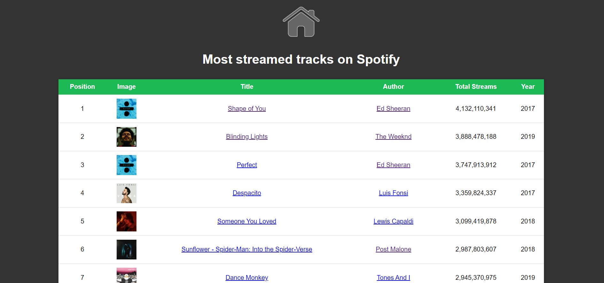

# SpotifyHelper
The project is a web application built using Flask, Python, HTML, CSS, JavaScript, and leverages the Spotify API and web scraping techniques. 
Users can explore trending music, access personalized recommendations, and gain insights into their listening habits. 
Overall, the project combines modern web technologies with external APIs and data acquisition methods to create an engaging and interactive music recommendation platform.

## Requirements
Requirements are listed in `requirements.txt` file.
```
beautifulsoup4==4.11.1
Flask==2.2.2
Requests==2.31.0
```

## Installation
To install the project and required packages, run the following command:
```
git clone https://github.com/radoslawrolka/SpotifyHelper
pip install -r requirements.txt
```

## Starting the app
To start the app just click on `SpotifyHelper.bat` (you can also create a shortcut for this file) or run the following command in directory with the project:
```
python3 run.py
```
Also due to privacy reasons, the Spotify API credentials are not included in the project. So you need to create your own Spotify API app and add your credentials to `.credentials` file.


## Authorize
For the application to function properly, consent to access some Spotify account data is required.


## Features
The functions are divided into three categories:
- Ranking:
  - Most streamed artists on Spotify of all time
  - Most streamed tracks on Spotify of all time
  - Most streamed albums on Spotify of all time
- Spotify Utilites:
  - Search for artists, tracks and albums
  - Recommendations based on a track, an artist or a genre
  - Recommendations based on your history
- For You:
  - User's top artists
  - User's top tracks


## Ranking
Data is acquired using Beautiful Soup 4 (BS4) scraped 
from [Spotify Charts](https://chartmasters.org/) to get the most streamed artists, tracks and albums on Spotify of all time.

 

## Spotify Utilities
Data is acquired using the [Spotify API](https://developer.spotify.com/documentation/web-api/) to authorize user, get the recommendations and search results.
- Search:

  

- Recommendations:
  
 
- Personalized Recommendations:


## For You
User's history of listening on Spotify collected over the last three months.
- Your most streamed tracks:


- Your most streamed artists:

